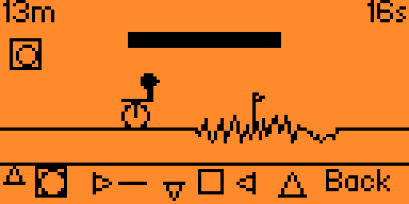

# Gurpil

Flipper Zero adaptation of the web game [Gurpil](https://github.com/Endika/gurpil): an endless
side-scroller where you pick your wheel shape on the fly to match the terrain and go faster.



## How to play

Press the D-pad to switch your wheel shape at any time:

| Input | Shape |
| --- | --- |
| **Up** | Circle ○ |
| **Right** | Line — |
| **Down** | Square □ |
| **Left** | Triangle △ |

Each shape is best on a different terrain (flat, rocky, uphill, obstacle) — match it to the
ground ahead to keep your speed up. Reach checkpoints to earn extra time and push your best
distance. The run is endless: it only ends when time runs out.

## Controls

**Menu**

| Input | Action |
| --- | --- |
| D-pad | Move cursor |
| **OK** | Select (Play / How to play / Credits) |

**In game**

| Input | Action |
| --- | --- |
| **Up / Right / Down / Left** | Pick wheel shape (see table above) |
| **Back** | Return to the menu |

## Build

Requires a local [flipperzero-firmware](https://github.com/flipperdevices/flipperzero-firmware)
tree, or [ufbt](https://github.com/flipperdevices/flipperzero-ufbt):

```bash
ufbt
ufbt launch
```

## Tests, format, lint

```bash
make test
make format
make linter
```

## License

[GPLv3](LICENSE)
